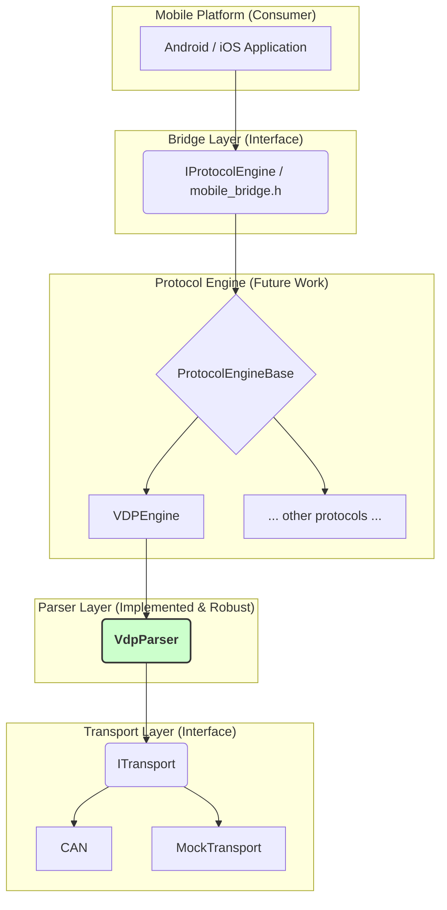

# VDPFrameParser Architecture Design

## Overview

This document describes the layered architecture design for the VDP[Vehicle Diagnostic Protocol] Frame Parser. The design focuses on separation of concerns, testability, and maintainability, ensuring the core parser is robust and can be seamlessly integrated into a larger protocol engine that connects to the `mobile_bridge.h` interface.

## Architecture Layers [needs mermaid viewer extension]



## Current Implementation Status

The current focus of this project has been to build a **robust and reliable `VdpParser`**. The `Parser Layer` is tested to handle:
- Valid frame parsing and data extraction.
- A comprehensive set of error conditions (invalid checksum, length, markers).
- Stream resynchronization after encountering garbage data.

The other layers (`Protocol Engine`, `Transport`) represent the future direction and are not yet implemented. This modular design ensures that the hardened `VdpParser` can be integrated into the full protocol stack in the future.

## Benefits of This Architecture

### 1. **Extensibility**
- Easy to add new protocols (UDS, J1939, etc.)
- Simple to support new transport types
- Mobile interface remains stable

### 2. **Testability**
- Each layer independently testable
- Mock implementations for hardware-free testing
- Comprehensive test coverage possible

### 3. **Maintainability**
- Clear separation of concerns
- Minimal coupling between components
- Easy to debug and modify

### 4. **Performance**
- Efficient streaming parser
- Minimal data copying
- Asynchronous operations where beneficial

## Implementation Status

### Completed
- Core parser (`VdpParser`) with comprehensive tests
- Interface definitions (`ITransport`, `IProtocolEngine`)
- Architecture design and documentation

### Next Steps
- Protocol engine implementations
- Mobile bridge implementation
- Mock transport for testing

### For Future
- Real transport implementations (CAN, Serial, etc.)
- Performance optimizations
- Additional protocol support

## Usage Examples

### Command-Line Tool Usage

The project includes a command-line executable for parsing VDP frames directly from a hex file. Each line in the file should contain hex characters representing the byte stream.

1.  **Build the project** to generate the `VDPFrameParser.exe` executable.

2.  **Run the executable** from your terminal. You can provide a path to a hex file or let it use the default `sample_frames.hex`.

**Example Command:**
```sh
# Run with the default sample file
./VDPFrameParser.exe

# Run with a specific file
./VDPFrameParser.exe path/to/your/frames.hex
```

**Expected Output:**

The tool will print the raw bytes of each processed frame and its status (either a valid frame or an error with a reason).

```
Raw bytes: 7E 07 01 10 00 01 88 7F 
Status: Valid frame

Raw bytes: 7E 
Status: ERROR. Reason: Invalid frame length: 0. Must be between 6 and 255.

...
```
