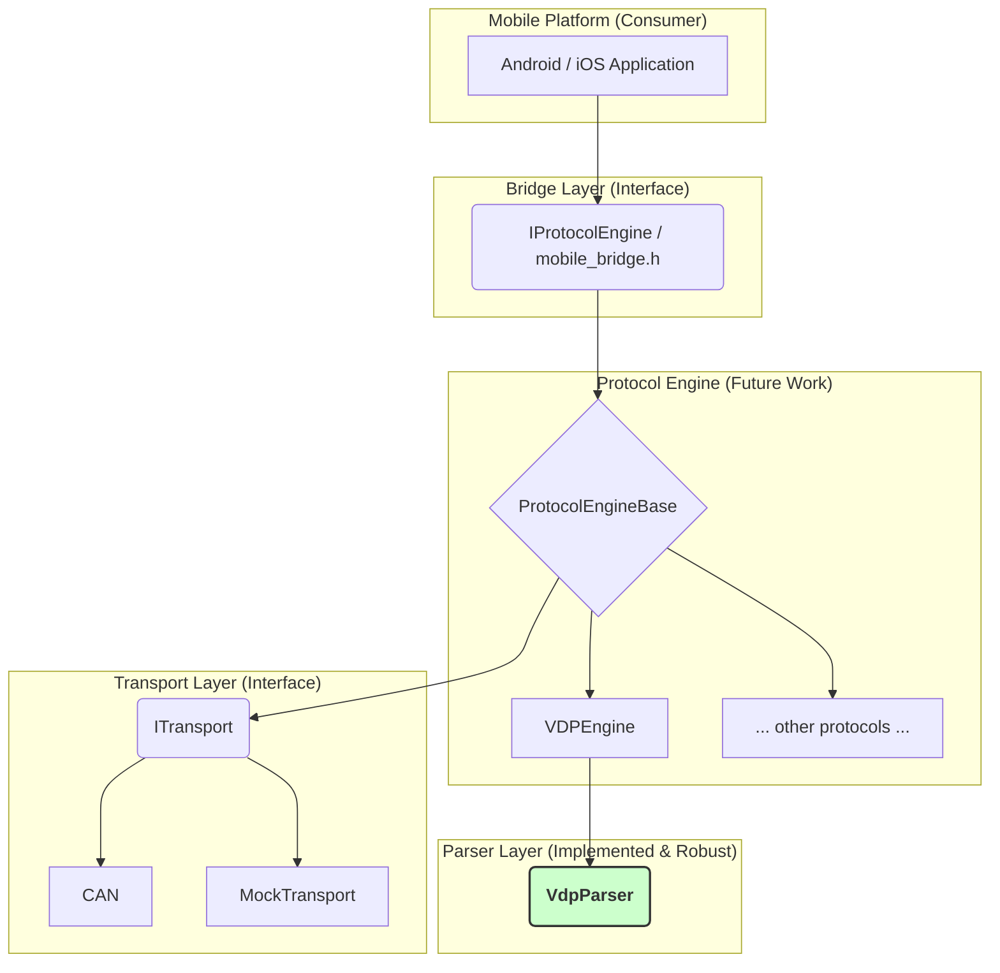

# VDPFrameParser Architecture Design

## Overview

This document describes the layered architecture design for the VDP[Vehicle Diagnostic Protocol] Frame Parser. The design focuses on separation of concerns, testability, and maintainability, ensuring the core parser is robust and can be seamlessly integrated into a larger protocol engine that connects to the `mobile_bridge.h` interface.

## Architecture Layers [needs mermaid viewer extension]


The diagram illustrates a layered architecture for the entire Vehicle Diagnostic Protocol system.
Here is a breakdown of each layer:

1. **Mobile Platform**
   `Android / iOS Application`
   Purpose: This is the user-facing application that the end-user interacts with.
2. **Bridge Layer** (Interface)
   `IProtocolEngine / mobile_bridge.h`  
   Purpose: This is the crucial API that connects the mobile application (written in Java/Kotlin/Swift) to the C++ backend. It defines a stable set of functions that the mobile app can call, hiding the complexity of the C++ code. This is the "contract" for how the two worlds communicate.
3. **Protocol Engine** (Future Work)  
   `ProtocolEngineBase,VDPEngine, other protocols ...`  
   Purpose: This is the "brain" of the diagnostic logic. It's responsible for managing the rules and state of a specific protocol (like VDP).
   ProtocolEngineBase is a generic template that contains common logic for all protocols.
   VDPEngine is the specific implementation for the VDP protocol. It would take high-level commands and decide what VDP frames need to be sent.
   The design makes it easy to add other protocols (like UDS) in the future by creating new implementations that inherit from ProtocolEngineBase.
4. **Parser Layer**   
   `VdpParser`  
   Purpose: Its single job is to handle the raw byte stream.  
   Outgoing: It can take structured data from the VDPEngine to assemble a valid byte frame to be sent.  
   Incoming: It takes raw bytes from the transport layer and parses them into structured, valid VdpFrame objects, or identifies errors.  
   The diagram highlights this component in green, noting that it is implemented and part of the assignment.
5. **Transport Layer (Interface)**  
   `ITransport`  
   `CAN, MockTransport`  
   Purpose: This layer is responsible for the actual sending and receiving of raw data bytes over a physical or virtual medium.
   ITransport is an interface that defines generic functions like send() and receive().
   CAN, DoIP, etc., would be concrete implementations that talk to the actual hardware.
   MockTransport is a fake implementation used for testing the upper layers without needing any physical hardware.
   
**How it Works Together (Data Flow)**  
   -  Sending a Command (Top-Down): The Mobile App calls a function in the Bridge Layer -> The Protocol Engine creates a command -> The Parser Layer serializes it into a byte frame -> The Transport Layer sends the bytes over the wire.
   -  Receiving a Response (Bottom-Up): The Transport Layer receives bytes -> The Parser Layer validates and parses them into a structured frame -> The Protocol Engine interprets the frame's meaning -> The Bridge Layer passes the result back to the Mobile App.

## Current Implementation Status

The current focus of this project has been to build a **robust and reliable `VdpParser`**. The `Parser Layer` is tested to handle:
- Valid frame parsing and data extraction.
- A comprehensive set of error conditions (invalid checksum, length, markers).
- Stream resynchronization after encountering garbage data.

The other layers (`Protocol Engine`, `Transport`) represent the future direction and are not yet implemented. This modular design ensures that the hardened `VdpParser` can be integrated into the full protocol stack in the future.

## Benefits of This Architecture

### 1. **Extensibility**
- Easy to add new protocols (UDS, etc.)
- Simple to support new transport types
- Mobile interface remains stable

### 2. **Testability**
- Each layer independently testable
- Mock implementations for hardware-free testing
- Comprehensive test coverage possible

### 3. **Maintainability**
- Clear separation of concerns
- Minimal coupling between components
- Easy to debug and modify

### 4. **Performance**
- Efficient streaming parser
- Minimal data copying
- Asynchronous operations where beneficial

## Implementation Status

### Completed
- Core parser (`VdpParser`) with comprehensive tests
- Interface definitions (`ITransport`, `IProtocolEngine`)
- Architecture design and documentation

### Next Steps
- Refactoring VDPParser and move the logic of protocol state and communication to an upper ProtocolEngine layer.
- The VdpParser should only be responsible for parsing and serializing: converting bytes to frames (extractFrames) and frames back to bytes (serializeFrame).
- Protocol engine implementations
- Mobile bridge implementation
- Mock transport for testing
- Add retry logic for failed responses
- Add different log levels, so that the info logs are minimal during real-time

### For Future
- Real transport implementations (CAN, Serial, etc.)
- Performance optimizations
- Additional protocol support

## Usage Examples

### Command-Line Tool Usage

The project includes a command-line executable for parsing VDP frames directly from a hex file. Each line in the file should contain hex characters representing the byte stream.

1.  **Build the project** to generate the `VDPFrameParser.exe` executable.

2.  **Run the executable** from your terminal. You can provide a path to a hex file or let it use the default `sample_frames.hex`.

**Example Command:**
```sh
# Run with the default sample file
./VDPFrameParser.exe

# Run with a specific file
./VDPFrameParser.exe path/to/your/frames.hex
```

**Expected Output:**

The tool will print the raw bytes of each processed frame and its status (either a valid frame or an error with a reason).

```
Raw bytes: 7E 07 01 10 00 01 88 7F 
Status: Valid frame

Raw bytes: 7E 
Status: ERROR. Reason: Invalid frame length: 0. Must be between 6 and 255.

...
```
## Performance and Profiling

This section outlines the strategy for ensuring the parser meets its performance requirements.

### Meeting the 100ms Performance Target

The 100ms response time is usually dominated by external factors like **network bus latency**, so the parser's CPU execution time needs to be minimal. 

Our strategy to ensure this is based on two principles:

1.  **Efficient, Non-Blocking Operations**: The parser uses `std::deque` for O(1) buffer manipulations and simple, single-pass loops for validation. It never performs blocking I/O, ensuring it returns to the caller as quickly as possible.
2.  **Minimal Data Copying**: Data is only copied once a complete, valid frame has been identified. This avoids unnecessary memory traffic and CPU cycles.

### Profiling Tools and Techniques

To verify performance and identify any potential bottlenecks, we will use standard, cross-platform tools:

-   **Benchmarking**: We can use a library like **Google Benchmark** or add std::chrono to mesasure the timing.

-   **CPU Profiling**: Tools like **Valgrind** on Linux, or the **Visual Studio Profiler** on Windows can be used to get a detailed function-level view of where CPU time is spent. I have used perf to create Flamecharts in the past for the same.

-   **Memory Profiling**: To ensure a minimal memory footprint, tools like **Valgrind** can be used to analyze heap allocations and ensure there are no memory leaks or unnecessary allocations. Add Address and leak sanitizers in the build pipeline.

### Retry mechanism

To ensure robustness when the 100ms performance target is not met, a retry mechanism should be in place. Below is the proposed design:

- **Configurable Retry Count**  
  The number of retry attempts should be configurable via an external configuration file. This allows flexibility in tuning the system based on use case and network conditions.  
  - The default retry count is **1**.  
  - The configuration should include **validation logic** to ensure the value stays within a safe range and doesn't cause excessive network load or degrade overall performance.  
  - Optionally, retries can be **enabled only for certain critical commands**, offering fine-grained control over retry behavior.

- **Timeout Definition**  
  A request is considered **timed out** if no response is received **within 100ms** after the **last byte of the request frame** is sent.

- **Retry Execution**  
  The system will maintain a buffer of sent requests and monitor their response status. If a timeout occurs:  
  - The same request is **automatically retried**.  
  - The retry count is incremented.  
  - This process continues until either:  
    - A valid response is received, or  
    - The maximum retry count is reached.

- **Failure Handling**  
  If all retry attempts are exhausted without a successful response:  
  - The operation is marked as **failed**.  
  - A **"Communication Error"** is reported to the user or higher-level system.
